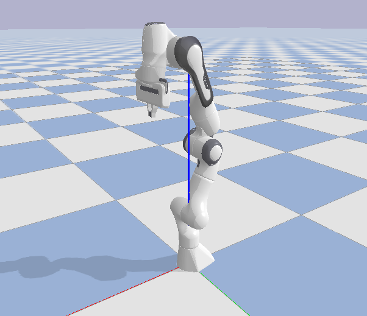
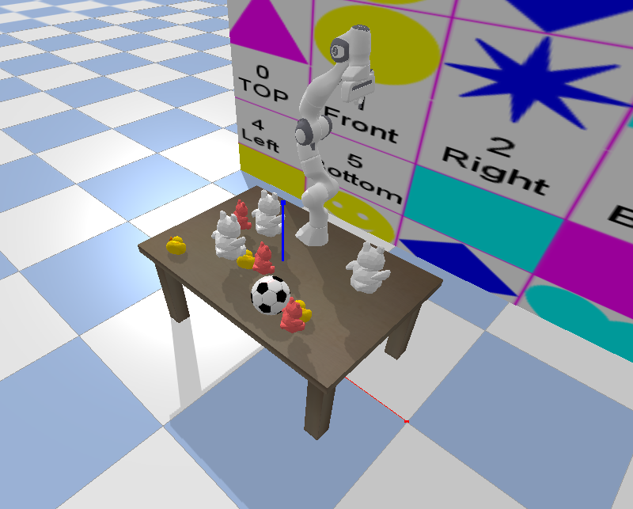
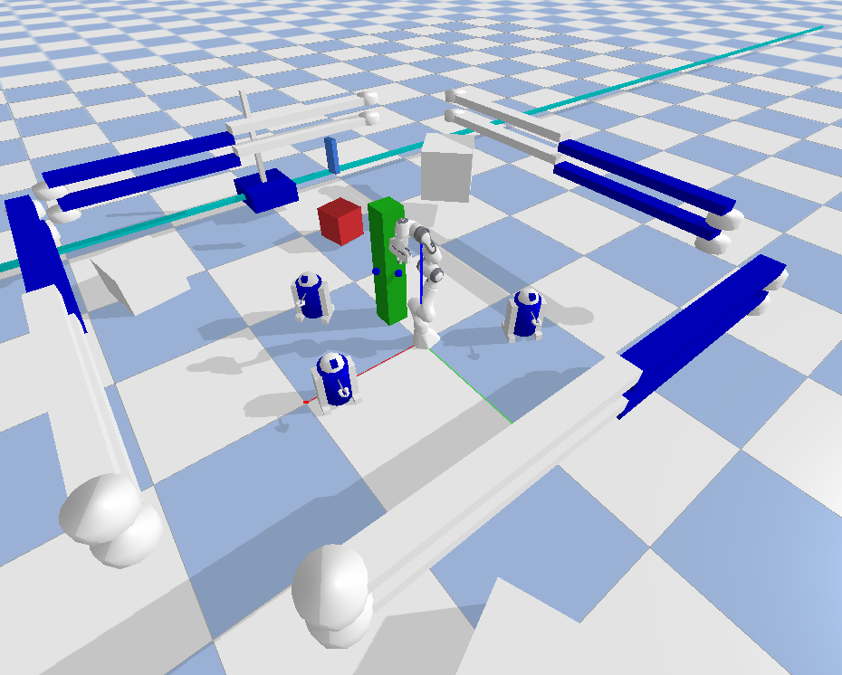

# A project apply manipulation algorithm on a 7-DOF panda arm
<p align="center">
  
</p>

[[Project report](./assets/project%20report.pdf) | [Presentation](./assets/Project_Video.mp4) | [ Gif Results](assets/Video_Demos) ]

## Content
* `main.py`: The main python file 
* `point_cloud.py`: Python file to get point cloud in PyBullet
* `utils.py`: Contains all the utils functions 
* `Planner/`: Contains all the path planning algorithms
    * `RRT`: Implementation of RRT and RRT*
    * `RRT_Real_Time.py`: Implementation of RT-RRT* 
* `assets`: Results (images,gifs), project report and report presentation video

## Introduction
We set up three environments in this project, and each enviroment is given one or multiple points for the arm end-effector to reach. It was aiming at mimic real life manipulation task like welding. THe reason why there's three environments its because we want to gradutely build up the problem step by step.

We are using [PyBullet](https://pybullet.org/wordpress/) as the simulation platform, and the panda arm was imported from pybullet official urdf file. 
<p align="center">
  
  <br>
  <em>Figure 1: Panda Arm</em>
</p>

We implemented 3 path search based path planning algorithm:

- [RRT (Rapidly-exploring Random Trees)](https://msl.cs.illinois.edu/~lavalle/papers/Lav98c.pdf). One of the most wildly used search based algorithm. It's fast, but neither optimal (guarrentee to find the optimal path) nor real time (do not rewire the path according to the environment during action phase).
- [RRT* (Optimal Rapidly-exploring Random Trees)](https://arxiv.org/pdf/1105.1186). Guarrentee optimality by adding a rewire step, but not real time either
- RT-RRT* (Real Time Optimal Rapidly-exploring Random Trees). Optimal and also real time
This one was inspired by this [paper](https://www.researchgate.net/publication/301463753_RT-RRT_a_real-time_path_planning_algorithm_based_on_RRT), while slightly different.

More detailed information about the algorithm can be found in the [project report](./assets/project%20report.pdf)


#### 1. Ball Kicking Environment:
In enviroment one, there's only one goal point (the football) and all the obstacles are static.
<p align="center">
  
  <br>
  <em>Figure 2: Ball Kicking Environment</em>
</p>


#### 2. Construction Site 1 (static obstacles)
In enviroment two, all the obstacles are static and there's four goal point (the four blue dot around the green pillar in front of the arm). Our goal is to have the arm end-effector reach the goal points in a given priority.
<p align="center">
  
  <br>
  <em>Figure 3: Construction Site 1 (static obstacles)</em>
</p>


#### 3. Construction Site 2 (dynamic obstacles)
In enviroment two, there's three moving obstacles (the R2D2) and there's four goal point (the four blue dot around the green pillar in front of the arm). Our goal is to have the arm end-effector reach the goal points in a given priority withput hitting the moving obstacles.

<div style="display: flex; justify-content: center; gap: 20px; align-items: center;">
  <div style="text-align: center;">
    
    <div>(a)</div>
  </div>
  <div style="text-align: center;">
    
    <div>(b)</div>
  </div>
  <div style="text-align: center;">
    
    <div>(c)</div>
  </div>
</div>

<p align="center"><em>Figure 4: Construction Site 2 (dynamic obstacles)</em></p>


For planning result you can check out the [gifs](./assets/Video_Demos), the [project report](./assets/project%20report.pdf), [video representation](./assets/Project_Video.mp4), or follow next section to run the code


## Try it yourself
Set up environment
```bash
conda create -n panda_env python==3.8
conda activate panda_env
pip install -r requirements.txt
```
Run 
```bash
python main.py --env 1 --env RRT
```
- Change the `--env` for different environment (`1,3,4`)
- Change the `--planner` for different algorithm (`RRT, RRT_Star, RRT_Real_Time`)

## Next step

The next step of this project is to apply learning mathod current or more complicated tasks. Here are some field we are going to try and some references
1. Mobile Manipulation
2. Reinforcement Learning (RL)
    - [RLHF](https://github.com/opendilab/awesome-RLHF) 
3. Imitation Learning (IL)
    - One-Shot Imitation Learning with Invariance Matching for Robotic Manipulation ([paper](https://arxiv.org/abs/2405.13178) | [code](https://github.com/mlzxy/imop) )
4. Visual Language Action model (VLA)
    